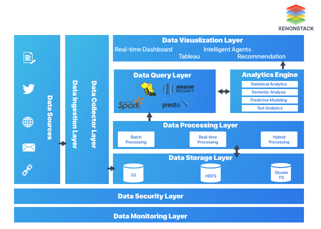
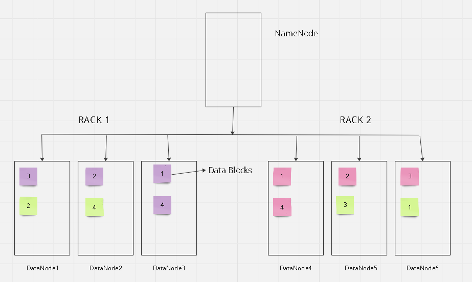
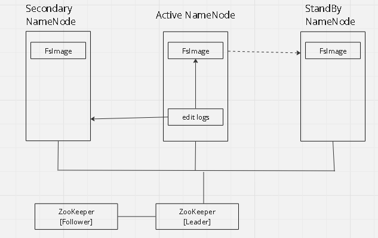

# **<u>Introduction to *BigData*</u>**

- BigData is data that has high volume, variety, velocity, veracity, and value.

- Used in - **banking**, healthcare, energy, technology, consumer, manufacturing
  
  - Banking: 
    
    - Transaction data is stored. Based on this data, bank decides factors like loans, pre-approved loan amounts. 
    
    - Credit card limit may also be set using this data. 
    
    - Credit score
    
    - Investments, medical insurance
  
  - Healthcare:
    
    - Food recommendation
    
    - Fitness routines
    
    - ECG, EEG, and other scans like X-Ray, MRI, etc
    
    - Personalized diagnosis
    
    - Early disease prediction
  
  - Energy:
    
    - EV + Hybrid, forecasting requirement and usage to set up new charging points
    
    - Energy consumption requirement to scale up production
  
  - Technology:
    
    - advancements in tecnnology
  
  - Consumer:
    
    - Forecasting product requirements and demand as per consumer purchasing it.
    
    - Logistics management [eg: grocery at your door]
  
  - Manufacturing:
    
    - Where to set up manufacturing plants

### Traditional Decision Making

Traditional decison making has various problems - 

- takes time to arrive at a decison, losing competitive advantage

- human intervention required at various stages, and human intervention can lead to regular failures 

- lacks systematic linkage among strategy, planning, execution and reporting

- due to limitation of storage, provides limited scope of data analysis, ie, provides only bird's eye view

- obstructs company's ability to make fully formed decision

### **The Solution: Big Data Analytics**

- Decision making based on what you know, which is based on data analytics

- Provides comprehensive view of overall picture, which is a result of analyzing data from various sources [sources like SQL and NoSQL databases, URLs, APIs]

- Provides streamlined decision amking from top to bottom

- Big data analytics helps analyze unstructured data

- Helps make faster decisions, giving a competitive advantage and reducing the time takes

## Case Study: Google's Self Driving Car

Technical Data [Sensor Data from vehicles] - Camera sensor, LiDAR, Ultrasonic sensor, IR sensor [proximity], GPS, accelerometer|gyroscope, temperature+pressure+humidity sensor

Community Data - Data collected from other vehicles to prepare route maps by analyzing traffic data and others

Personal Data - For personalization, like frequent routes, settings, etc

# Big Data

It refers to extremly large data sets thet may be analyzed computationally to reveal patterns [clusters], trends, and associations [data mining, for recommendation systems], especially relating to human behavior and interactions.

Forecasting [or Time Series Forecasting] is usually done using LSTM and ARIMA models

##### 4 V's of Big Data. as per IBM

- Volume - Entire amount of generated data

- Variety - Various types of data from various different sources

- Veracity - Truthfulness of data

- Velocity - Rate of generation being generated

- [There is a 5th V, Value - Data must provide information that add value to organization/company]

##### Different Types of Data

- Structured - Data in tablualar format, having rows and columns. Collected from databases, excel sheets, spreadsheets, etc.

- Semi-Structured - textual data files with an apparent pattern. Collected from XML, JSON, CSV, TSV files
  
  ```xml
  <!-- XML format example -->
  <row_id>
  <column_name> value </column_name>
  ```

- Quasi-Structured - Textual data, with erratic formats that can be formatted with effort and software tools. Example is clickstream data.

- Unstructured - No structure in data, stored as different type of file usually. Example is PDFs, images, videos, text documents

### Case study in BigData: Netflix

1. When do users watch a show?

2. Where do they watch?

3. On which device do they watch?

4. How often do they pause the program?

5. How often do they re-watch?

6. Do they skip credits?

7. What are the keywords searched?

### Big Data Analytics Pipeline

Big data is a problem, because how should be handle this problem of humungous size of data?

Data is collected from various sources - Emails, URLs, weblogs(clickstream data), text, etc



Tools in data ingestion layer

- SQOOP tool helps import and export data from structured source to a destination [dest. is Hadoop Distributed File System]. It is bidirectional. DATABASE<===>SQOOP<===>HDFS

- Flume is unidirectional, used for migrating data from URL (live streaming source) and collect it to store in HDFS. Collect data at regular interval from source and send it to HDFS.

- Kafka is used for collecting data in streaming format. 

Batch Processing - Result obtained by performing some process on data collected over a large period of time. Data in sql server is imported to HDFS using SQOOP. On this huge volume of data, analysis is performed to get some result. Analysis is on stored data.

Stream Processing/Realtime Processing - Data collected in small small intervals and processed collectively. Analysis is on live data, not stored data.

### <u>Big Data Case Study</u>

*Traditional vs Distributed System* - 

Distributed machines share storage and resources. So, a machine taking 1hr to do some task can be done in few seconds by using distributed machines with same specs.

So, as data grows we can add more devices to the distributed network - instead of buying a completely new machine setup.

Traditional machines support only vertical scaling [adding more storage, new cpu, more ram, etc which are already present in the machine]. But in distributed, systems, we can just add a new machine to the distributed network [horizontal scaling - add a new machine, vertical scaling - update existing machine].

Distributed machines are commodity hardware

### Features of Big Data

##### Scalability in Big Data

Scalable platform accomodates rapid changes in growth of data, either traffic or volume. We add hardware and/or software in order to increase output and storage of data. Having a scalable platform means that the company will be ready for potential growth in data needs.

##### Fault Tolerance in Big Data

It refers to working strength of a system in unfavourable conditions and how that system can handle such a condition. HDFS also maintains replication factor by creating a replica of data on other machines

##### Data Inconsistency

Conflicting phenomenon may occur at various granularities. It occurs from knowledge content, data, meta-information, and can adversely affect quality of outcomes in BigData analysis process.

### Distributed System

It is a model in which components located on networked computers communicate and coordinate their actions by passing messages.

#### Challenges of Distributed Systems

- System failures

- Limited bandwidth

- High programming complexity
  
  The solution to these problems is : ***Hadoop***

### Solution to Big Data Storage - Hadoop

It is a framework that allows distributed processing of large datasets across clusters of commodity computers using simple programming models.

Created by Doug Cutting.

Storage Management - Hadoop Distributed File System, 

Programming Methodology - MapReduce, 

Resource Management - YARN [Yet-Another-Resource-Negotiator]

### Characteristics of Hadoop

- Scalable - Can follow both horizontal and vertical scaling

- Highly Available [Reliable] - Stores copies of data on different machines, thus resistant to mechanical failure

- Economical - CAn use ordinary computers for data processing

- Flexible - Can store huge data and decide to use it later
  
  In traditional system, data is sent to the program. In hadoop, program is sent to the data.
  
  Hadoop follows disc-only processing 

### Traditional Database Systems vs Hadoop

| RDBMS                                                   | ------       | HADOOP                                                                                        |
| -------------------------------------------------------:|:------------:|:--------------------------------------------------------------------------------------------- |
| Structured                                              | Data Types   | Multi and Unstructured                                                                        |
| Limited, no Data Processing                             | Processing   | Processing coupled with Data                                                                  |
| Standards and Structured                                | Governance   | Loosely Structured                                                                            |
| Required on Write                                       | Schema       | Required on Read                                                                              |
| Reads are fast [it is read many/write many]             | Speed        | Writes are fast [it is read many/write once]                                                  |
| Software License                                        | Cost         | Support Only                                                                                  |
| Known Entity                                            | Resources    | Growing, Complexities, Wide                                                                   |
| OLTP, Complex ACID Transactions, Operational Data Store | Best Fit Use | Data Discovery, Processing Unstructured Data, Massive Storage/Processing --> Batch Processing |

## Hadoop

It is an open-source software framework developed on Distributed Files System for storing data and runnig applications on clusters of commodity hardware. HDFS is highly fault tolerant.

    Hadoop is programmed using JAVA.

Modes of Hadoop conifigurations - 

- Standalone Mode - All Hadoop services runs in a single JVM on a single machine

- Pseudo-Distributed Mode - Each hadoop runs on its own JVM, but on a single machine. (Only one replica here)

- Fully Distributed Mode - Hadoop services runs on individual JVM, but reside in separate commodity machine in single cluster

## HDFS Architecture

Hadoop has 3 components - 

- hadoop distributed file system (HDFS) -> for distributed storage

- Yet-Another-Resource-Negotiator(YARN)-> for efficient reusource managementwhile using processing of data

- MapReduce (MapR) -> Programming methodology

Hadoop Distributed File System is one of the key components of Hadoop Ecosystem, designed to store and manage large volumes of data across a distributed network machine. Its architecture is designed to handle high throughout (output) access to data and provide fault-tolerance and high availability.

###### HDFS Architecture Components [3 services of HDFS]

- NameNode - It acts as master server that manages metadata of file system. Its role is to keep the file system info [path to data blocks]. There is only one NameNode, called as active NameNode. Also keeps track of replicas and file permissions. As user, you will only interact with NameNode

- DataNode - Acts as worker node and keeps actual block of data.
  
  - HDFS has default block size of 128MB. File will be separated into different blocks , so for larger files, they will be separated into different blocks based on block size. *Block Size is **not** the memory consumed by a file, it is only used to determine the number of blocks.*

- Secondary NameNode - Backup for NameNode.

Rules:

- NameNode tries to access nearest DataNode while performing Read and Write operations

- NamedNode distributes data block in such a way all resources are efficiently utilized

- Same data block will never be replicated in same DataNode



-- If any data node goes down, data blocks in that node will be replicated in all the other available data nodes. 

[In image, Violet 1-4 are 4 parts of same data, Pink is its replica, and Yellow is also its replica. Three colors indicate the 3 copies of same data. 1Pink and 1Yellow and 1Violet will never be in same DataNode]

-- if a downed DataNode comes back online, the newly created replicas are automatically deleted.

This is a Master-Slave architecture. NameNode is master, DataNodes are slave nodes

###### Concept of Multiple NameNodes

We have active NameNode and secondary NameNode.



Above is HDFS High Availability Architecture

FsImage is snapshots of activities, edit logs show just the differences. It contains the 
complete directory structure (namespace) of the HDFS with details about 
the location of the data on the Data Blocks and which blocks are stored 
on which node.

At regular intervals, FsImage will be copied to **Secondary NameNode**, same is copied to **Standby NameNode** also.

Incase active one goes down, secondary or standby becomes new active NameNode.

[2 alternatives are not compulsory, but it is good.]

[StandBy becomes Active if Active goes down. Only if StandBy is not present, will Secondary be taken as new Active node. But in that case, ]

Any tasks performed by user is represented in terms of edit logs.

[Edit logs are like temporary, FsImage is permanent]

Notes -|

Primary function of secondary NameNode is to perform checkpointing. Checkpointing involves periodically merging NameNode's edit logs [changes in file system] with current file system [FsImage]. This happens at regular interval in Secondary NameNode.

NameNode keeps edit logs of all modifications made to the file system. Over time, this log can grow large, hence Secondary NameNode helps to convertthese edit logs into file system [FsImage] by creating checkpointing. Over time, if edit logs can grow large, NameNode will take more time to convert it into FsImage by restarting it. During this phase, cluster will be down.

Secondary NameNode helpsin reducing recovery time of the cluster. Due to checkpointing, downtime of cluster minimizes.

-- FsImage is FileSystem NameSpace, which indicates path to filesystem in cluster's DataNodes. It will also keep track of number of replicas, all replica paths, file system, etc.

In older versions of Hadoop Distributed File System [HDFS], cluster used to be down frequently, as logs and FsImage used to take lot of space in Memory [RAM]. Due to shortage of RAM, cluster used to go down. This got resolved in Hadoop 2 after introducing Secondary NameNode concept.

ZooKeeper has follower which will take backup, and leader which will be directly connected to cluster's NameNode. ZooKeeper acts as coordinator that will monitor health of Active NameNode, and it makes desicions of automatic fail-over where it will replace existing NameNode with StandBy NameNode. [StandBy becomes Active only when it receives all logs from FsImage].

Each DataNode sends it status to NameNode at regular intervals, called "Heartbeat". It can be used to know if a DataNode is down or not. 

[User cannot directly interact with the DataNode, only with NameNode ]

###### 27-08-2024

## Hadoop Hands-On

VM password: hadoop@123

##### some useful commands

| <u>Command</u>               | <u>Function</u>                                                                                       |
| ----------------------------:|:----------------------------------------------------------------------------------------------------- |
| sudo                         | superuser do, avoid issues of permission                                                              |
| mkdir                        | make directory                                                                                        |
| mv src dest                  | move from source to destination                                                                       |
| cd path                      | change directory to change into [new path starts with / if its not in continuation from current path] |
| ls                           | list files and directories                                                                            |
| ls -l                        | lists file with many other informations                                                               |
| sudo tar xvzf 'file'         | to extract .tar.gz file                                                                               |
| history                      | all commands that have been run                                                                       |
| cd ~                         | go back to home directory, ~ denotes home directory                                                   |
| sudo apt-get install package | install some package                                                                                  |
| sudo apt-get remove package  | uninstall some package                                                                                |
| sudo touch newfile2.txt      | create a file in specified path                                                                       |
| reboot                       | command to reboot the machine                                                                         |
| clear                        | clear terminal screen                                                                                 |
| whereis python3              | where python 3 is installed, case sensitive                                                           |

hadoop installation prerequisites:

- java environment

- all communication between nodes is through secure shell, i.e. SSH protocol

- IPv6 needs to disabled, as secondary namenode might later cause issue with it.

<u>Permissions in linux:</u>

d at front means directory, else it is just file

777 ->   -RWX-RWX-RWX [user, group, others]

(7 = 4+2+1)

localhost:50070  --> namenode ui

localhost:8088    --> hadoop cluster

https://medium.com/@amitmishra_393/hadoop-3-0-installation-on-ubuntu-18-04-step-by-step-pseudo-distributed-mode-2808f6b8e71f

#### HDFS basic commands:

| <u>Command</u>                                                     | <u>Function</u>                                                                                      |
| ------------------------------------------------------------------:|:---------------------------------------------------------------------------------------------------- |
| hadoop fs                                                          | looks for services of Hadoop                                                                         |
| hadoop fs -mkdir /newdir                                           | make a new direrctory with name newdir                                                               |
| hadoop fs -mkdir -p /newdir1/newdir2/newdir3                       | makes directory within directory                                                                     |
| hdfs dfs -copyFromLocal newfile.txt /newdir                        | copies file from local directory to HDFS directory                                                   |
| hdfs dfs -put source destination                                   | same function as above command                                                                       |
| hdfs dfs -cat /newdir/newfile.txt                                  | show content of file in path mentioned                                                               |
| hdfs dfs touchz /newdir1/tempfile.txt                              | create a new empty file in specified path                                                            |
| hdfs dfs -appendToFile newfile.txt /newdir1/tempfile.txt           | copeid content from newfile.txt to tempfile.txt; there can be multiple source files                  |
| hdfs dfs -cat /newdir1/tempfile.txt > newfile2.txt                 | copy content from HDFS to local                                                                      |
| hdfs dfs -put newfile2.txt /hdfs                                   | copy from local and put it in HDFS directory                                                         |
| hdfs dfs -cp /hdfs/newfile2.txt /newdir                            | copy to newdir folder                                                                                |
| hdfs dfs -copyToLocal /newdir1/tempfile1                           | copy file from Hadoop to local destination not mentioned, so it is home, ie /home/hadoop             |
| hdfs dfs -get /newdir1/tempfile1                                   | get is alternative to copyToLocal                                                                    |
| hdfs dfs -ls /                                                     | show all files and folders                                                                           |
| hdfs dfs -ls -R /                                                  | show all files and folders, recursively                                                              |
| hdfs dfs -rm /hdfs/newfile2.txt                                    | delete file in specified path                                                                        |
| hdfs dfs -rm -r /newdir                                            | deletes the directory and everything in it                                                           |
| hdfs dfs -rmdir /hdfs                                              | deletes the directory if it is empty                                                                 |
| hdfs dfs -expunge                                                  | empty all trash                                                                                      |
| hdfs dfs -ls /hdfs/*                                               | see details of all files in specified folder                                                         |
| hdfs dfs -chmod 766 /hdfs/newfile.txt                              | give specific permission to some file                                                                |
| hdfs dfs -chown hadoop:hadoop /hdfs                                | change ownership of file and folder; owner is hadoop, group is also hadoop                           |
| hdfs dfs -chown -R hadoop:hadoop /hdfs                             | change ownership of file and folder recursively                                                      |
| hdfs dfs -stat /hdfs/newfile.txt                                   | shows date when file was created                                                                     |
| hdfs dfs -stat %r /hdfs/newfile.txt                                | shows status of replicas                                                                             |
| hdfs dfs -stat %b /hdfs/newfile.txt                                | shows file size, in bytes                                                                            |
| hdfs dfs -setrep 3 /hdfs/newfile.txt                               | set replication factor to 3                                                                          |
| hdfs dfs -du /                                                     | size occupied by each directory, in bytes                                                            |
| hdfs dfs -du -h /                                                  | size occupied by each directory, in human readable format ie bigger sizes will be shown in kb and mb |
| hdfs dfs -df /                                                     | size occupied by cluster [add -h for human readable format]                                          |
| hdfs dfs -count /                                                  | number of files, directories, and size                                                               |
| hdfs dfs -count /hdfs                                              | number of files, directories, and size in specified directory                                        |
| hdfs dfs -Ddfs.blocksize=blockSizeInBytes -put newfile.txt /newdir | set block size to 'blockSizeInBytes'                                                                 |

#### Cluster Maintenance commands:

| <u>Commands</u>                              | <u>Function</u>                                          |
| --------------------------------------------:|:-------------------------------------------------------- |
| start-dfs.sh && start-yarn.sh                | Start cluster services                                   |
| stop-yarn.sh && stop-dfs.sh                  | Stopping cluster services                                |
| jps                                          | check if everything is running or not                    |
| hdfs fsck /                                  | returns status of cluster                                |
| hdfs fsck / -files                           | shows status of each file                                |
| hdfs fsck / -files -blocks -locations        | shows status of files, blocks, locations                 |
| hdfs fsck / -files -blocks -locations -racks | shows status of files, blocks, locations and racks       |
| hdfs balancer -threshold 1                   | if there is an unbalanced situation, it will be balanced |

## Hadoop Ecosystem

???

## YARN Architecture

-- Yet-Another-Resource-Negotiator.

2 sections - Job Scheduler + Application Manager

2 nodes -> Master node and slave node


<u>Job Scheduler</u> -> when user submits job, it goes to job scheduler which *schedules job* according to 3 schedulers available [FIFO, FAIR, Capacity Scheduler]. Job Scheduler will alse be *allocationg resources* to the job.

<u>Application Manager</u> -> Accepts job from job scheduler, requests node manager to allocate containers[virtual space where resources and data exist], monitors job execution and request to distribute resources as required, if job fails requests to restart job. [resources allocated here may not be enough]

<u>Node Manager</u> -> allocates resources and allocates a dedicated app master to monitor status of running containers. Each job has separate app master. Also sneds status of slave node using signal (heartbeat) at regular intervals

<u>App Master</u> will monitor resources and negotiate with application manager about resources required for running the job. App Master destroyed once job is finished. Container will also be destroyed.


## Hadoop 2.x Core Components

=> HDFS, MAPREDUCE, YARN

## MapReduce Closer look

MapReduce is a programming methodology, how the code will be executed.

We need it because it supports parallel processing, which can help speed up the process by splitting the process into various tasks.

<u>InputSplit</u> is used for splitting data based on some delimiter. [eg: for input a sentence, split into individual words]

<u>RecordReader</u> splits as as key and value. [the key is unique, an offset value]. RecordReader is important in running JAVA MapReduce job only. [eg: outputs like (1, Word1), (2, Word2)]

<u>Mapper</u> converts previous one into (Word1, 1), (Word2, 1)..... This intermediate output is stored in the temporary storage of HDFS.

<u>Partitioner</u> is a pre-reducer step to which ensures same key will be combined together. Right after partitioning, shuffling and sorting takes place. Determines how output of *Mapper* is distributed across *Reducers*. Decides which key-value pair will go to which Reducer. Ensures load of data among reducer is balanced. Shuffling is done such that all identical keys will be near so that they will be processed by same Reducer itself [this is an optimization task].

<u>Combiner</u> is an *optional stage* right after Partitioner. Kinda like a semi-reducer, or, a optional local reducer which performs partial aggregation. Performs partial aggregation on Mapper outputbefore being sent to Reducer itself. It reduces volume of data needed to be transferred between Mapper and Reducer. [kinda like , aggregates within specific block itself]

<u>Reducer</u> performs the aggregate operations, and a file is generated which is saved back to HDFS. [number of reducer depends on number of nodes]

All these happens inside the container in nodes. + In-Disk operation

[input for MapReduce is always from HDFS]

## Hadoop Streaming Mapreduce using Python

4 methods to print:

print("Statement: ", value)

print("Statement: %s", value)

print("Statement: {}".format(value))

print(f"Statement: {value}")

sys module

python's standard library, offers functiions and variables that interact with python interpreter and os

sys.argv -> asks you to provide list of command line args to be passed to script

system.exit -> exits program with specified exit status

system.path -> provides list of paths providing search paths for the module

sys.stdin -> file like object representing standart input stream. used to read input from user or from input path. used when you need to handle input from command line

Q: From Employees.csv, extract countries to show name and frequency of 20 most common countries.

1. In home directory, create a folder 'emp_mapr' using `sudo mkdir emp_mapr`. Using sudo commands will prompt user to enter password - in this case it is `hadoop@123`.

2. Change current working directory to *emp_mapr* directory `cd emp_mapr`.

3. Create *mapper.py* project file - `sudo nano mapper.py`

4. Write the below program *mapper.py*. Press *Ctrl+O* the *Enter* to save and then *Ctrl+X* to exit. Map contains select operations.
   
   ```python
   #!usr/bin/python3
   """mapper.py"""
   import sys
   # input comes from standard input
   for line in sys.stdin:
       # remove leading and trailing whitespaces
       line = line.strip()
       # if line is not empty
       if line:
           columns = line.split(',')
           if columns:
               country = columns[-1].strip()
               # write the results to strdout(standard output)
               # delimited by comma
               # output of mapper is the input to reducer
               print('%s,%s' % (country, 1))
   ```

5. Make the *mapper.py* file executable by running the following command: `sudo chmod 777 mapper.py`

6. Create *reducer.py* project file - `sudo nano reducer.py` 

7. Write the below program *reducer.py*. Press *Ctrl+O* the *Enter* to save and then *Ctrl+X* to exit. Reduce contains aggregate operations.
   
   ```python
   #!/usr/bin/python3
   """reducer.py"""
   import sys
   
   current_country = None
   current_count = 0
   country = None
   records = []
   
   # input comes form STDIN
   for line in sys.stdin:
       line = line.strip()
       # parse the output we got from mapper.py
       # word and count are separated by comma
       # 1-> no of splits
       country, count = line.split(',', 1)
   
       # convert count from string to int
       try:
           count = int(count)
       except ValueError:
           # discard the input as count was not a number
   
       # this IF works only when Hadoop sorts the output from mapper 
       # before passing as input to reducer[sort by country]
       if current_country == country:
           current_count += count
       else:
           if current_country:
               # write result to stdoutput, or store as tuple
               records.append((current_country, current_count))
           # making current_country = country, 
           # as we counted all from a single country
           current_country = country
           current_count = count
   
   # output the last country
   if current_country == country:
       records.append((current_country, current_count))
   
   # sort records
   records.sort(key=(lambda x:x[1]), reverse=True)
   
   # show top 20 records only
   hard_limit = 20
   current_limit_value = 0
   for record in records:
       if current_limit_value<=hard_limit:
           print('%s\t%s' % (record[0], record[1]))
           current_limit_value += 1
       else:
           break
   ```

8. Make the *reducer.py* file executable by running the following command: `sudo chmod 777 reducer.py`

9. Test if *mapper.py* is working properly by running the following command: `cat /home/hadoop/Downloads/employee.csv | python3 mapper.py`. This gives your CSV file as input to the mapper, which takes 'country' field from each row and makes it like '(country,1)'.

10. If *mapper.py* is working correctly, feed its input to *reducer.py* by running the following command: `cat /home/hadoop/Downloads/employee.csv | python3 mapper.py | sort -k1,1 | python3 reducer.py`. The *mapper* gives output in a tuple like form in each line; *sort -k1,1* sorts that according to key [here, it will be country] thereby grouping same country together; *reducer* simply counts how many times the same country appears together inorder to find frequency.

11. Make a new directory in HDFS named *Employee* by running the following command: `hdfs dfs -mkdir /Employee`.

12. Move your dataset from *Local* to *HDFS* using the following command: `hdfs dfs -put /home/hadoop/Downloads/employee.csv /Employee`. An alternative to previous command is -  `hdfs dfs -copyFromLocal /home/hadoop/Downloads/employee.csv /Employee`.

13. Run Mapreduce streaming job using the following command: `hadoop jar /usr/local/hadoop/share/hadoop/tools/lib/hadoop-streaming-2.7.6.jar -file /home/hadoop/emp_mapr/mapper.py -mapper mapper.py -file /home/hadoop/emp_mapr/reducer.py -reducer reducer.py -input /Employee -output /Employee/output/`.

14. To see final output, run `hdfs dfs -cat /Employee/output/*`. 

15. *Note: Running step 13 another time can result in an error due to creation of new output folder with same name as existing one. So, change last output file name.*
    
    eg: Change `-output /Employee/output/` to `-output /Employee/output1/`.
    
    *Next Note: used [mockaroo](https://www.mockaroo.com/) to a random generate dataset*

# Spark

## Big Data and Need for Spark

BigData refers to collection of large and complicated datasets of the following 4 types:

- Structured Data -> RDBMS Data, Excel Data, Spreadsheet Data

- Semi-Structured Data -> XML data, JSON data, CSV data, ORC format, Parquet format, AVRO format. [orc, parquet and avro are called bigdata file format. they return queries fuch faster than other formats and also uses much less space to store same data]

- Unstructured Data ->  Images, Videos

- Quasi-Structured Data -> Web clickstream data

## Challenges in Traditional Data Formats

Spark provides a solution to real-time processing (or, stream processing). 

In traditional UBER infrastructure - Data sources can be Kafka, Key-Value DB, or RDBMS. Vertica is used for storage. Processing involves ETL Adhoc Analysis [Extract (data from sources), Transform (involves cleaning the data), Load (to storage to perform analysis)]. 

Some important questions: 

- *Small number of Larger Data Blocks vs Large number of Smaller Data Blocks* =>> Small number of Larger Data Blocks is better - more blocks will introduce more overhead, we are looking to find solution for large data. ORC takes 256MB block size as default.

- How does Hadoop achieve fault tolerance? =>> 
  
  - Replicas of DataBlocks across multiple nodes
  
  - Secondary NameNode (multiple NameNode concept)

- If a file size is 129MB, how many datablocks will it create in HDFS?
  
  - 2 datablocks, (128MB + 1MB)

- How does Hadoop handle data consistency?
  
  - Write once and Read many. Once a file is written in HDFs, it cannot be modified (it can only be deleted and replaced.) It assumes all data nodes read same version of the file

- How does YARN differ from original MapReduce framework in version 1?
  
  - In original MapReduce framework (version 1), JobTracker was responsible for both resource management and job scheduling - this led to 2 major issues: *scalability factor* **and** *regular job tracker failures due to overburden of tasks it was performing*. 
  
  - Now, Resource Manager is responsible for job scheduling, resource management, and monitoring. App Manager is used for job execution, resource negotiation with resource manager. Now, we have better scalability and flexibility

- Flow of MapReduce?
  
  - InputSplit -> RecordReader -> Mapper -> Partitioner -> Combiner -> Reducer

- Suppose MapReduce job has 10 map tasks and 5 reduce tasks. If one of the node running map fails, what impact will it have on overall job execution? And how does hadoop handle it?
  
  - If a node that was running a map task fails, Hadoop will reschedule failed map task on another available node. System ensures job continues by rerunning only the failed map task. Fault tolerance mechanism ensures overall execution is resilient to individual node failure.

- In a hadoop cluster where multiple applications are running simultaneously, what would be impact of increasing replication factor of HDFS on overall system performance?
  
  - Positive: Improved fault tolerance and data reliability by storing more copies
  
  - Negative: Higher storage utilization, negative impact on write performance(due to multiple write operations), more load on datanode, high network traffic.

- How would you optimize performance of map reduce job that can be running longer than expected?
  
  - resource allocation - ensure YARN allocates resources appropriate for job execution.
  
  - data locality - minimize data transfer across the network by ensuring that tasks run on nodes where data is located.
  
  - balancing number of map and reduce tasks align with cluster's capacity

Uber's new infrastructure has same data source, but storage has changed to HDFS and Processing is by Apache Spark now. Spark can handle both real-time and batch processing.

Solution

- More data warehouse options - Hive, Presto, and Spark. 

- Hadoop Upserts and Incremental [Hudi] was introduced, an open source Spark library

- Hudi provides abstraction layer on top of HDFS and Parquet to support required update and delete operations.

- Hudi enables user to take out just modified data incrementally, boosting query efficiency and enabling incremental changes.

## Data Processing

Technique of manipulating information. Refers to transformation of unstructured data into meaningful and readable information.

Challenges: cleaning null values, duplicates, outliers, multiple formats, incorrect data, incorrect indexes, inconsistency

Types  do data processing:

- Batch/Bulk processing

- Real-time processing => Data collected in some interval, which is given to Spark.

### Batch Processing

- large volume of data processed in a single batch

- data collected over a certain period of time

### Real-time Processing

- Data processed as soon as it is generated

- Processing time is smaller due to small volume of data

- only data generated in that time-frame is processed

Batch Processing vs Real-Time Processing

|     |     |
| --- | --- |
|     |     |
|     |     |
|     |     |

## MapReduce

Framework that allows to create applications that reliable

In map reduce, raw data we have in LOCAL storage needs to be moved to HDFS. Map job performed on data giving intermediate output written to temporary storage of HDFS. It is read to another map job and again intermediate o/p is written, It is read into map job which again gives intermediate o/p which is finally given to reducer. Reducer will give the final outcome, which is finally written to HDFS.

Spark does not have intermediate outputs, and also not in-disk.

Hive (AdHoc policy+Warehouse)

Pig (scripting language)

Giraph (graph analysis)

Apache Storm (real-time processing)

Mahout (machine learning)

Tez (faster version of mapreduce)

above things were frameworks for big data analysis, now they have all been replaced by Spark

#### Limitations of MapReduce:

- Unsuitable for real-time processing

- Unsuitable for trivial operations

- Unsuitable for large data on network (ie realtime)

- Unsuitable with OLTP

- Unsuitable for processing graphs (property graph)

- Unsuitable for iterative execution

#### Spark over MapReduce:

Spark can:

- Batch processing

- Structured data analysis - spark DataFrames are simple

- Machine learning analysis - for clustering, recommendations, classifications 

- interactive SQL analysis - Spark has interactive environment: spark shell for scala, and pyspark [hadoop uses Java, spark uses Scala]

- real-time streaming data analysis -- Spark Streaming can be used, instead of specialized libraries like Apache Storm

Apache Storm is a specialized library, bur has some limirarion:

Advantages

- FOSS distribured e

- ?

- ?

Limitations:

- NO framework support

- ?

Advantages of Apache Spark

- Storm is complex for developers, so Spark is preferred

- Spark can help with multiple processing problems, like batch processing, stream processing and iterative processing

- ?

## Apache Spark

Open source framework for real-time data processing, contains following components - Python, Java, Scala, R programming

Features:

- Suitable for real-time trivial operations

- Open source cluster computing framework

- Provides upto 100 times faster performance for in-memory, and 10 times faster for in-disk, compared to MapReduce [why? it avoided making intermediate results]

- Suitable for machine learning algorithms

Q1: In which type of processing collects data for a time period and does process -> Batch processing

Components of Spark:

- Spark SQL - read from various structured data

- Spark Streaming - enables fault tolerant processing of real-time data

- MLLib - provides tools like ML algorithms

- GraphX - Perform and manipulate graphical parallel computations

- SparkR - Enalbels R alnguage users to leverage power of Apache Spark

SparkCore --> Core engine of Apache Spark

Working of Apache Spark Architecture:


Entry point is Spark Context

Driver program - Execution/Entry point. If it doesn't run, cannot start. It creates spark context and negotiates with Cluster Manager for resources. Spark Context object helps coordinate with all distributed processes. Default object name for Spark context is sc.

Cluster Managers - Provides executors for code execution. 3 major cluster managers: Spark standalone, YARN, Mesos, also Amazon EC2.

Executors - Runs tasks scheduled by driver. Uses cache slots to keep data in memory and task slots are Java threads that run code.

In worker node

- Executor responsible for tracking tasks that are running

- the tasks in a node are running parallel

*Spark is master and worker, Hadoop is master and slave.*

Either create a py file and do 'spark submit'. Or define a ipynb to host spark

30-08-2024

When you start `spark-shell` or `pyspark` - 2 default sessions are started: SparkContext and SparkSession. `spark-shell` is for Scala, `pyspark` is with Python. SparkSession is required if you want to create a DataFrame, or use SQL. SparkContext is compulsorily needed for everything.

Spark Context:

- SparkContext is the crucial component which represents connection to Spark cluster

- SparkContext is entry point for using Spark APIs, Spark methods. 

- Responsible for managing lifecycle of Spark applications.

- SparkContext handles allocation of resources required by executors.

- Manages configuration for Spark Applications

- Resilient Distributed Datasets - fundamental data structure of Spark. PySpark has RDD and DataFrames; Java and Scala also has one more datastructure.

Cluster Manager:

- Job Scheduler - schedules work to worker nodes. Ensures that tasks are distributed among worker nodes

- Cluster manager responsible for scaling-up or down of resources depending on work load or demand

- Fault tolerance - handles node failures and resource reallocation to maintain stability and reliability of cluster

- If job fails, Cluster Manager can reschedule the tasks

- Resource management [not allocation, but optimization] - monitors and manages cluster's resources efficiently; 

### Resilient Distributed Datasets:

- enables fault-tolerant distributed in-memory ??

- collection of objects distributed across worker nodes in the cluster

- it is an immutable collection of objects that defines the data structure of Spark

RDD Features:

- Lazy Evaluation -- script not executed unless it is called or action command is called. Creates a graph called directed acyclic graph helps recover RDD incase any step fails. DAG is a graphical representation the RDDs and operation to represented in form of vertices and edges.

- In-memory computation

- Fault-tolerant -- 

- Partitioning -- equivalent to number of workers. `rdd.repartiton()`helps increase number of partitions.`rdd.coalecse()`helps reduce number of partitions.

- Persistent

- Immutable

- Location stickiness

Ways to create Spark RDD: 

- sc.parallelize(), -  from any collection

- sc.textfile(), - external file 

- from existing RDD - 


'Vertex' is stage of each application or job. Relation between 2 vertices is the 'Edges'.

List of transformation:

Transformation is the process ce

- Wide Transformation:  

### Spark Hands-On

31-08-2024

### Spark Job Execution Flow

- code is submitted by using `spark -submit` to Spark Context [ie, driver program]

- spark context does 2 things: job scheduling and physical execution plan [aka, DAG].

- after DAG is formed, stage division

- then task scheduling, done by DAG scheduler

- task assigned to workers/executors

- task queueing [FIFO]

- worker1, worker2

### PySpark DataFrames

Schema is structure of data, showing column name along with column data types

RDD had a limitation in the tasks - less availability of APIs as its a lower level datatype

DataFrame can be constructed from Hive, structured data Files, existing RDDs, and External databases like HBase and SQLServer.

Creating dataframe - [in python notebook]

###### 04/09/2024

### Hive

- Hive is a part of Hadoop ecosystem

- "SQL over Hadoop MapReduce" Hive query looks for the presence of Hadoop services. [ie running on top of Hadoop services]. each query is run as a MapReduce job. 

- Apache Hive is a SQL like open-source warehousing application that extract data from Hadoop and related systems.

- Query rank on top of HDFS storage. [other storage is NoSQL database, which is a HBase database]. YARN is the ResourceManager. 

Features of Hive:

- Developed by Facebook around 2007

- Open-Source Apache project

- Provides high-level abstraction on top of MapReduce and Apache Spark. 

- Uses HiveQL - Hove Query Language

- Mostly useful for structured or semi-structured type of data. 

Datatypes supported by Hive - Int, TinyInt, Boolean, Float, Double, String, decimal, char, varchar, date, binary ...

SQL Semantics:

- SELECT, LOAD [for csv files, don't use with HDFS as cut-paste will happen], INSERT [from existing table insert into new table]

- Expressions in WHERE and HAVING

- GROUP BY, ORDER BY, SORT BY

#### HIVE Architecture

- There is a Metastore, named as metastore_db. It is the permanent store for metadata. 

- RDBMS is data warehouse [DerbyDB is the integrated RDBMS in Hive]

- 3 ways to connect to Hive - CLI, Hive Thrift server [using .hql file format, Beeline CLI], Hive Web interface [named **HUE**, which is a web editor]. 

- 

#### Hive Job Execution Flow:

1. **Parser** - write a Hive query, look for syntax errors, check for schema, then we convert query into DAG if everything is fine. `Hive query -> Parser -> Check syntax, error, schema&dataypes -> if all fine, convert to DAG`

2. **Optimizer** - query optimization for faster querying; can add catalyst for faster execution

3. **Executor**: Splits job into multiple tasks and executes them. It is Executor's job to collect DAG and perform the MapReduce job [if running in Hadoop] or Spark job [if running in Spark].

4. **Submit** job to cluster

5. Monitor progress

6. Process data in MapReduce[Hive] or Apache Spark[Apache Spark]

7. Store data in HDFS

Planner - determines how query is converted into Physical Execution Job [ie DAG].

Thrift Server uses **Beeline**, which is an alternate CLI which allows multiple users to connect to HIVE server simultaneously.

JDBC and ODBC are used for Java and Spark programs to connect to Metastore. Also, to connect to external tools/programs. ODBC is for Oracle,  for Derby/SQL  JDBC.

##### Partitioning and Bucketing

[ They are 2 key features due to which we use Hive. ]

Partitioning splits data into certain category.

Example, buying an ipad from Amazon. We need a query that will produce results fast. Without partitioning, query will scan entire 'Product' dataset: `SELECT * FROM Products WHERE item='ipad'`.

 If we partition it into sub-categories like 'Fashion', 'Electronics', etc, query will only need to search for product in one category: `SELECT * FROM Products WHERE Category='Electronics' and item='ipad'`. [*NOTE: we are not just making a change in the query, fun creating a separate file with this partitioning*].

We can further partition it into sub-categories to make querying faster.

When partitions are done, a new file will be formed for each category and sub-category. too much partitioning is bad as even though querying through multiple small files are faster it will cause enormous load on the system due to massive parallel processing and overhead caused.

Partitioning follows unequal distribution, ie count of items in each category may be largely different.

Bucketing essentially makes sure that sizes of the files are almost same. eg: `CLUSTER BY states INTO 30 BUCKETS`- this will produce 30 files.

- So, what happens in case of India is that states like Kerala and TN may have individual files, but Sikkim, Goa, UT's may all be in a single file, but Uttar Pradesh may have more than a single file.

- In case of Croatia, which may have much less than 30 states [assume 10], only those 10 buckets will be filled, others empty.

eg: country population world data, 30 buckets of India might be each of size 1GB but for Croatia, each of 30 buckets may be 1MB only [also, not necessary that all ]

Why we have Bucketing? Problem with Partitioning is that one category's records may be much larger compared to another. This will make the MapReduce job difficult as this particular record will be taking much more time. So, we create buckets so as to make that large record into smaller multiple files. This will also improve the MapReduce job as all files have almost equal number of records.

Partitioning is Map Job, Bucketing is Mapper + Reducer Job.

## Streaming

It is the continuous flow of data at a high speed.

Streaming applications generate a continuous flow of data, which is fed into the Stream Processor. Queries are made to the Stream Processor, and it gives back responses.

Social media, OTT are examples of streaming sources.

### Real time BigData Processing Lifecycle

[image]

Flume and Kafka loads data

Stream processing is done by ReadStream()

Data Storage is HDFS (disk), HIVE (warehouse), NoSQL(NoSQL)

### Batch Layer

Features:

- stores raw data as it arrives

- computes batch view for consumption

- manages historical data

- ?

- ?

### RealTime Layer

Featurse:

- receives arriving data

- performs incremental update to batch

- has incremental algorithms implemented at speed layer

- significantly reduced consumption cost [as there is less data at a time in streaming]

### Introduction to Spark Streaming

Broker si a server

Producer -->  Broker -->  Consumer

Message is subscribed to Topic

ssc -> spark streaming context [entry point]

#### Features of Spark Streaming

- Scaling: 

- ?

- ?

- ?

- ?

- ?

#### WorkFlow of Spark Streaming

Data collected in definite regular intervals of time, 

Discretized stream/DStream 

Task Scheduler   and a Memory manager.

Streaming is not actually real-time as there will be a small lag [data collected in every time interval, like 5 seconds]

1. Data collected collected from sources like WebScoket, URL, Twitter, HDFS, Flume, Kafka, Local FS

2. Data given to ssc, then split as T0, T1, T2, ...

3. RDD transformation done

4. Data collected at regular interval from RDD

5. Stored or printed

05-09-2024

- Source - dat coming at regular interval [T0 T 1 T1]

- Receiver -SparkStreamingContext splits data into batches [no of batches depend on window size]

- Divide data stream into batches

- Batches of input data as RDDs [known as DStream] is streamed, which is given to task scheduler

ssc.start() is action command

DStreams - fundamental abstraction in spark stremaing is Discretized Stream. S series of RDDs that characterizes it. InDSteam data from time 0 to 1 will be one RDD, 1 to 2 will be another, and so on

`Streaming Context --> Transformation of Data --> Output`

Transformations on DStream -> map(), flatMap(), filter(), repartition(), union(), coun(), join(), cogroup(), transform(), forEachRDD().

functions we give as parameters are usually lambda functions.

Output Operations in DStream - print(), saveAsTextfile()...

## Analytics in Spark

3 types of analytics - 

- Descriptive - Describes the past and answers the question - "What happened?". That is, we analyze historical data to get insights on them. Data aggregation and data mining is used for Descriptive Analysis. EDA and Statistical methods like(mean, median, sum, count) can be used here.

- Predictive -  Answers the question of "What might happen?". This tries predicting the future. Statistical methods and forecast techniques are used for predictive analysis.

- Prescriptive - Advices users on possible outcomes and answers the question: "What should be done?".

### Machine Learning Introduction:

ML mimics data inorder to gain knowledge and makes decision

Machine Learning is a subset of Artificial Intelligence.

- AI is a branch of CS dedicated to creating intelligence to create intelligent machines .

- ML is a subfield of AI involved in development of self-learning algorithms inorder to gain knowledge and make predictions based on it

- In training phase, input and output is given to the mathematical model inroder for it to lean; and in testing phase, only input data is given and function has to generate the output data. If this can be successfully done in the testing phase, then it means the model is working as intended.

### AI vs ML vs DL

- AI mimics human or animal decision making ability

- ML is a subfield of AI that involves development of algorithms to gain knowledge

- DL is a subset of ML that aims to use structures like neurons in human brains and mimic their functions.

### Relationship between Data Science and Machine Learning

DS aids in ....

### Phases of  ML:

1. Collect data

2. Data Wrangling [cleaning data]

3. Analyze Data

4. Train algorithm

5. Test algorithm - save modell as .pickle or .h5 format

6. Deployment

### Types of Machine Learning:

1. Supervised learning  -  target is available, label based learning, 

2. Unsupervised learning  -  target is not available

3. Semi-supervised and supervised  -  supervised+unsupervised

4. Reinforcement learning  -  learning from experience, goal-based experience

Supervised Learning:

- When we say that a model is being trained, we are finding the values for coefficients [in case of  y=B~0~ + B~1~x]

- 2 types - regression and classification. if y is continuous, it is regression and if y is categorical it  is classification

Unsupervised Learning:

- Allows model to discover patterns and information that were previously undetected.

- Decision tree and random forest are used here as

- PreProcessing is about normalizing data - importance is that functions understand numbers only, and they need to understand.

- Not all inputs are features, but all features are inputs.

- Normalization is used so that different values are scaled to a single common range inorder to make them have the same effect. [eg: salary and age, salary normally has higher value which can skew the output. thus normalize them all to same range inorder to have proper outputs].

### MLlib

It is a scalable ML library for Spark consisting of common learning algorithms, tools, and optimization techniques.

#### Major tools:

- ML algorithms --> Classification, Regression, Clustering, Optimization, Feature extraction, Recommendations, Reductions, Basic Statistics

- Featurization  --> feature vector

- Pipelines  --> helps combine multiple steps together

- Persistence

- Utilities

- 

#### ML Pipeline - Process Flow:

- Data Ingestion

- Data Cleaning and Transformation

- Model Training

- Model Testing 

- Model Deployment and Integration

06-09-2024

# BigData File Formats

[blog]([Big Data File Formats](https://www.clairvoyant.ai/blog/big-data-file-formats))

### AVRO

- row based storage format

- widely used as serialization platform

- hardly any compression

- ideal for creating a landing-zone file format for faster reads and hen transforming.

- schema in JSON format, so east to read and interpret

### PARQUET

- columnar format - all data stored in a single row. values of a single column are kept continuous. [eg: names are stored continuously, following that ages]

- more efficient in storage [and higher compression] when stored as `.parquet` in HDFS.

- values are nearby, meaning aggregation becomes simpler

## ORC

- Optimizer Row Columnar

- Footer contains - list of stripes in file, no. of rows per strips, each column's data type. Also contains aggregate values for each stripe that is getting created.

- File footer - per stripe info about file like: no of records, data type of each column, stripe level aggregate operations

- Default block size is 256MB.

# Spark GraphX

- Graph is a set of points that are interconnected by lines. [Graph is a DataType]

- Set of points are called vertices and interconnecting lines are called edges.

- Arrow in edge represents who follows who. This is stored in a file. Direction of arrow depends on who was forst.

### Applications of GraphX

- Fraud Detection System

- PageRank

- Disaster detection System

- Business Analysis

- Geographic Information System

- Google Pregel

- Flight data analysis

### Types of Graphs

- Undirected Graph

- Directed Graph

- Vertex labelled Graph

- Edge labelled Graph

- Cyclic Graph

- Weighted Graph --> each branch is given a specific weight

- Directed Acyclic Graph

- Disconnected Graph -->  Atleast 2 vertices are not connected to any other

GraphX is a new component in Spark for Graphs and graph parallel computation

Runs on system-parallel system Framework.

GraphX is widely used in Scala Programming (not supported in PySpark)

GraphX expects RDD as input and gives result as RDG [Resilient Distributed Graph]

# Data Warehouse Architecture


`DataSources -> StagingArea -> Warehouse -> Users`

Operational Systems are SQL server and other databases

Staging Area is second step,where transformations are done here on the data [ETL].

`Extract Data Sources -> Transform in Staging Area -> Load and Save to Data Warehouse` Transformations can include select, datatype conversion, filter, data cleansing,  etc.

Data Extraction -> Extract data from source systems

Data Transformation -> Changing data sources into exact format.

Data Loading -> Loading the data into Data Warehouse 

#### Steps in ETL:

1. Determine target data needed in warehouse

2. Determine al internal and external data sources

3. Prepare data mapping for target data elements from sources

4. Establish comprehensive extraction rules

5. Determine data transformation and cleansing rules

6. Plan for aggregate tables

7. Organize data staging area and test tools

8. Write procedures for all data loads

9. ETL for dimension table

10. ETL for fact table

#### ETL Key Factors:

- Complexity of data extraction and transformation - diversity of sources, and need to pay attention to each of them; **heterogeneity of source systems**

- Data Loading Functions - execute **capture without impacting source systems**; schedule incremental loads *[new data available after previous was already loaded]* without impacting use of warehouse by users.

**Data Extraction** - have to extract from various sources, and extract data on changes for ongoing incremental loads.

#### Issues in data extraction ->

- source identification

- method of extraction

- extraction frequency

- time window

- job sequencing

- exception handling

#### Data Extraction Techniques

- Data of Revision:
  
  - Immediate data extraction - ie extraction is real-time
  
  - Deferred data extraction - do not capture changes in real-time. If we don't want to capture in real-time, two ways then: either capture based on timestamp, or capture by comparing files

- Techniques of Data Extraction
  
  - Capture of Static data
  
  - Capture through transaction logs
  
  - ?
  
  - ?
  
  - ?
  
  - ?
  
  - ?

#### Data Transformation

extracted data might not be directly usable in warehouse. We will have to do some operations on the data:

- Conversion  -  conversion applied on a single field, either to make it more understandable for the user; or to standardize the data 

- Summarization

- Enrichment

##### Major Transformation Types / Transformation Functions:

- Format Revisions
  
  - making changes to data types

- ?

- Calculated and Derived values

- Splitting of a single field

- Merging of Information - combination of different fields from different sources

- Character set Conversion

- Conversion of Units of measurements [eg: distance in kilometers and miles within same column]

##### Data Integration and Consolidation

- biggest challenge of ETL is the pulling together of all source data from many disparate, dissimilar source systems.

- This is a kind of preprocessing of data before any transformation is done on them.

Different Types of Keys - 

- Primary key - uniquely identifies a row of the table

- Foreign Key - key common between tables, used to join them if needed

- Surrogare key - artificial key generated to  uniquely identify records, often used as a primary key. example is auto-incremented number.

##### Loading

3 types - Initial Load, Incremental load, Full Refresh [completely erasing out previous content and reload fresh data]

During loads, warehouse must be offline; need to find a time such that it can be scheduled without affecting the users. DIvide entire load process into chunke, 

Staging area - area where data from different sources come and we need to comine them. To apply data, we need to write specias load programsn, or use special utilities coming with DBMS, which provide a fast method for loading.

Types of merges:

- ?

- ?

- Destructive merging

- Constructive merging

Cost of UPDATE  increases based on percent of records to be cleaned. Cost of REFRESH pretty much remains the same.

## ETL Tools:

3 broad categrpies:

- DataTranspormetion engine

- Data capture???

- ????

# SSIS

## Components:

- Control Flow [tasks and containers(group of tasks)]

- Data Flow [heart of SSIS, responsible for extracting, transforming and loading data]

- Event Handler - Responds to specific events occurring during task completions

- Variables - useful if you want to add some SQL tasks in control flow

- Package Explorer - 

- Connection Managers

- 

- 
  
  
  
  noelroberttemp@outlook.com

word - [`n03lr0b3rt`]

In terms of SSIS, what is difference between Full Cache, Partial Cache, and No Cache [in the lookup block]

Full Cache:

- the lookup transformation retrieve and store in SSIS cache the entire set of data from the specified lookup location. data flow in which the lookup transformation resides will not start processing any data buffers until all of the rows from the lookup query have been cached in SSIS.

Partial Cache:

- lookup values will still be cached, but only as each distinct value is encountered in the data flow.

No Cache:

- will not add any values to the lookup cache in SSIS. As a result, *every single row* in the pipeline data set will require a query against the lookup source

In SQL Server Integration Services (SSIS), the Lookup transformation allows you to match data from the input with a reference dataset. The caching options—Full Cache, Partial Cache, and No Cache—determine how the data is stored and accessed during the transformation process. Here’s a breakdown of each caching mode:

### 1. Full Cache

- **Description**: The entire reference dataset is loaded into memory before the data flow begins.
- **Performance**: Generally provides the fastest performance for lookups because the transformation doesn’t need to query the reference data source repeatedly.
- **Memory Usage**: Requires more memory, as all reference data must be cached. This can be an issue if the reference dataset is very large.
- **Use Case**: Ideal when the reference dataset is small to moderately sized and the transformation performance is critical.

### 2. Partial Cache

- **Description**: Only the rows needed for the current batch of data are loaded into memory. If the dataset needs more rows, additional rows are fetched as required.
- **Performance**: Provides a balance between memory usage and performance. It’s useful when the reference dataset is too large to fit into memory all at once.
- **Memory Usage**: Uses less memory than Full Cache because it only stores a subset of the reference data at any given time.
- **Use Case**: Suitable when the reference dataset is large, and you need to manage memory usage while still benefiting from some level of in-memory caching.

### 3. No Cache

- **Description**: The reference data is queried directly from the source for each row in the input dataset. There is no caching of reference data.
- **Performance**: Generally the slowest option because each lookup operation involves a database query or access to an external data source.
- **Memory Usage**: Minimal, as no data is cached in memory. The reference data remains on the source server.
- **Use Case**: Appropriate when the reference dataset is very large or changes frequently, making caching impractical or unnecessary.

### Choosing the Right Cache Mode

- **Small Reference Dataset**: Use Full Cache for optimal performance.
- **Medium to Large Reference Dataset**: Consider Partial Cache to balance performance and memory usage.
- **Very Large or Frequently Changing Reference Dataset**: Use No Cache to avoid memory issues and ensure data freshness.

Each caching option impacts performance and resource usage differently, so your choice will depend on the specific needs of your SSIS package and the characteristics of your reference data.
